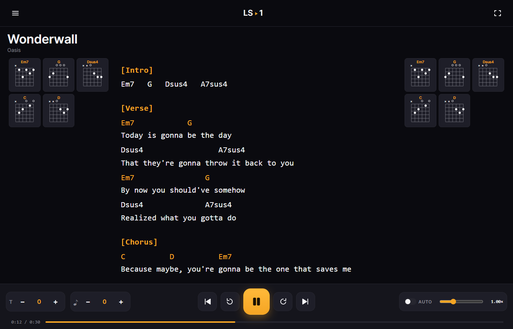
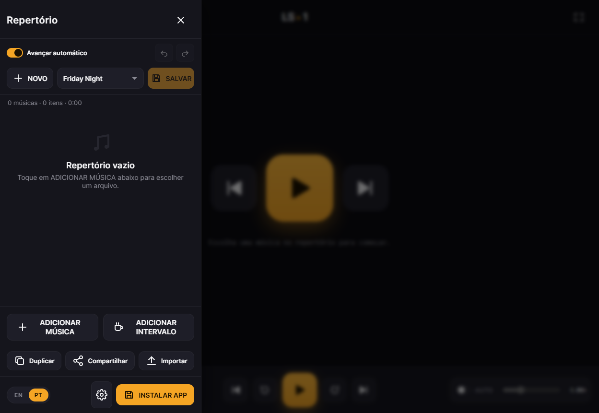
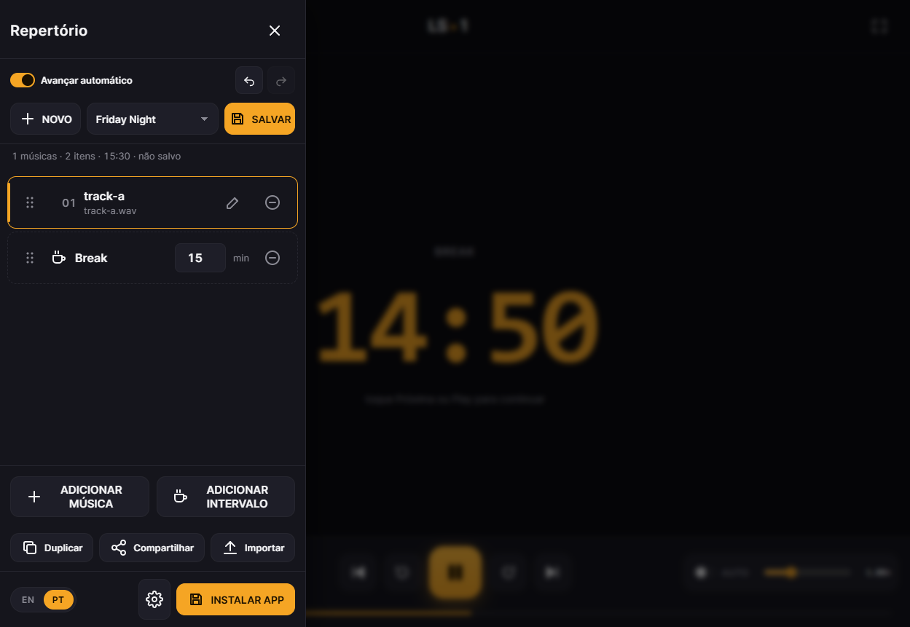
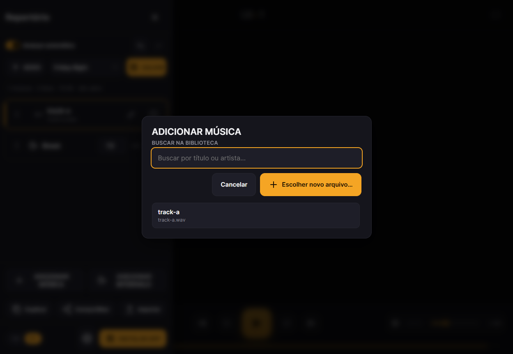
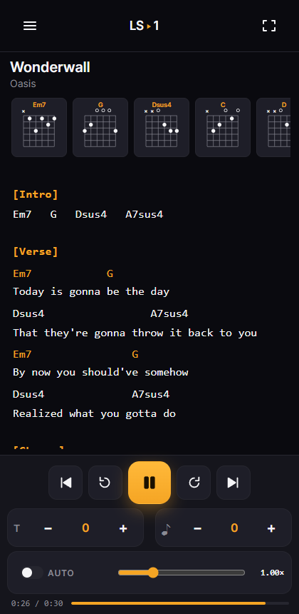
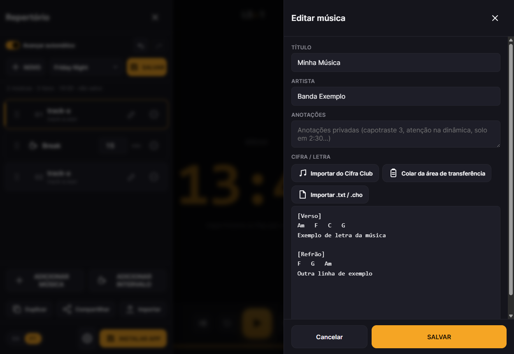

# LiveSet 1

**The set list app for the stage, not the studio.**

Pick a song, get chords and lyrics on screen, build tonight's set list, and never worry about the music stopping — even mid-song, mid-edit, mid-gig. LiveSet 1 is a local-first Progressive Web App: no login, no cloud, no subscription. Your songs never leave your device.

### [▶ Try the live demo](https://acleitao-projects.github.io/LiveSetApp/)



<table>
<tr>
<td></td>
<td></td>
<td></td>
</tr>
</table>

### Why musicians use it

- 🎸 **Chords + lyrics, always in view** — auto-scroll, transpose, chord diagrams on both rails, adjustable font size for stage lighting.
- 🎚️ **The audio never stops** — reorder, add, remove, edit a cifra, or fix a typo mid-song. Playback is fully decoupled from the set list.
- ☕ **Break countdown** — a big, stage-visible timer for sound-check and set-changeover, right where the cifra usually is.
- 🔁 **Undo / redo** — `Ctrl+Z` reverses the last add, remove, or reorder. Built for tablets and fat fingers between songs.
- 🖐️ **One reorder gesture, every device** — the same pointer-driven drag works identically on mouse, touch, and pen.
- 📱 **Installable, offline-first PWA** — tuned for phones, tablets, and desktop alike; keeps working with no signal in the venue.
- 🇧🇷 **EN / PT bilingual UI** — plus one-click Cifra Club import and clipboard-paste cleanup for Brazilian repertoire.

<table>
<tr>
<td width="50%"><br><sub>Tuned for phones and tablets, not just desktop.</sub></td>
<td width="50%"><br><sub>Paste a cifra straight from the clipboard — junk from the source page is stripped automatically.</sub></td>
</tr>
</table>

---

## Run locally

From this directory:

```powershell
python -m http.server 4173 --bind 0.0.0.0
```

Open `http://127.0.0.1:4173/`. Run the automated suite with:

```powershell
npm test
```

There are no build steps and no runtime dependencies. It is a static site.

## What it does

- **Pick a song from your device** — no import ceremony. On Android and desktop Chrome the app remembers the file across launches (File System Access API). On iPad/iPhone Safari the audio is silently copied into browser storage.
- **Search your library before picking a new file** — ADD SONG opens a small search-first picker over songs you've already imported, so building a second set list doesn't duplicate your library. "Pick new file…" is always one tap away.
- **Import and edit MP3 tags** — title, artist, and embedded `USLT` lyrics are read automatically. Saving a song writes those edits back to the original MP3 on Chromium, or to LiveSet's local copy on Safari.
- **Build a set list** — songs and breaks, reorder with a single pointer-driven drag gesture that behaves the same on mouse, touch, and pen, save when you want.
- **Undo / redo set list edits** — `Ctrl+Z` / `Ctrl+Shift+Z` (or the drawer buttons) reverse the last add, remove, or reorder.
- **Auto-advance, per set list** — toggle whether songs chain automatically when one ends, or wait for you to hit Next/Play. Some bands want a seamless medley, others want to talk between songs.
- **Break countdown timer** — entering a break screen shows a big, centered mm:ss counting down — a sound-check or set-changeover clock the whole stage can read.
- **Play through the set list** — full transport (prev / rewind / play·pause / forward / next), space bar toggles play.
- **Edit any song's lyrics + chords** from the setlist row. Import `.txt`/`.cho`, paste straight from the clipboard (cleaned of Cifra Club page clutter automatically), or search Cifra Club directly. Cifra edits, transpose, and scroll speed save immediately per song — even if you never save the set list itself.
- **Transpose** ± semitones on the Performance screen. Original cifra text is never modified; transposition happens on display. A separate ±3-semitone pitch-preserving audio shift is available per song too.
- **Chord diagrams** rendered offline from a bundled vocabulary; unknown chords fall back to a text card.
- **Auto-scroll** with a live speed slider. Speed is persisted per song.
- **Fullscreen** mode collapses everything to cifra + a floating play/pause pill.
- **Share a set list** — the Web Share API hands it straight to WhatsApp, Telegram, or email on mobile; falls back to a downloadable `.json` where Web Share isn't available.
- **Playback invariant** — the audio never stops when the set list changes. Add, remove, reorder songs or breaks, edit a song's cifra, transpose, change speed: the current playback continues untouched.

## What it deliberately does not do

- No AI stem separation. Removed in v0.2 — the target devices (tablets/phones) can't run it reliably.
- No standalone song library screen or track editor as a separate nav destination — songs are only ever browsed via the search-to-add picker or edited inline from the set list row.
- No `.liveset` export/import package format (set lists export/import as portable `.json`; full backups are separate).
- No cloud, accounts, or sync.

## Layout

- `src/app-v2.js` — application shell + all views + event handling (rendering, drag/reorder, undo/redo, break timer, transport).
- `src/audio.js` — long-lived `AudioEngine` wrapping a single `<audio>` element.
- `src/song-service.js` — song picking (FS Access API + OPFS fallback), dedupe, persistence.
- `src/storage.js` — IndexedDB + OPFS wrappers.
- `src/models.js`, `src/setlist.js` — Song / Setlist schemas + stable-ID mutations.
- `src/cifra.js`, `src/chords.js`, `src/transpose.js` — parsing, diagrams, transposition (pure).
- `src/cifraclub-import.js` — Cifra Club search/import, plus clipboard-paste cleanup.
- `src/icons.js` — inline SVG icon set.
- `src/app.css`, `src/performance.css` — dark obsidian design system, amber accent.
- `about/` — static marketing landing page (screenshots, pitch, install link, EN/PT toggle).
